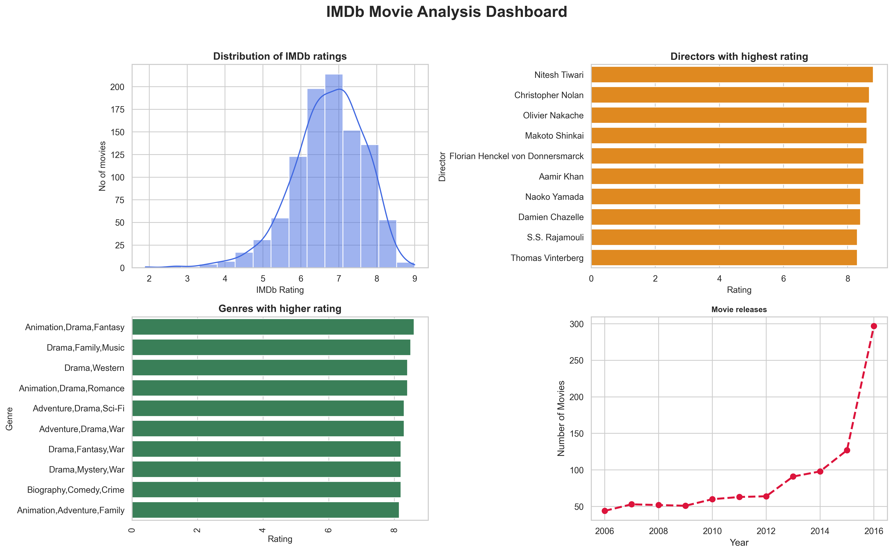

# 🎬 IMDb Movie Analysis

An exploratory data analysis (EDA) project on the IMDb Movie Dataset using Python.

The goal of this project was to understand the dataset, clean missing values, explore movie trends, and present the findings through visualizations and a simple dashboard.

## 📊 Analysis Performed

- Top 10 highest-rated movies
- Directors with the highest average ratings
- Highest-rated movie genres
- Movies released each year
- Highest revenue-generating movies
- Most voted movies
- Average movie rating by year
- Average runtime by genre

## 🛠️ Tech Stack

- Python
- Pandas
- NumPy
- Matplotlib
- Seaborn

## 📁 Project Structure

```text
IMDb-Movie-Analysis/
│── imdb_movie_analysis.py
│── IMDB-Movie-Data.csv
│── dashboard.png
│── README.md
```

## 📸 Dashboard



## 🌱 What I Learned

Through this project, I improved my understanding of:

- Exploratory Data Analysis (EDA)
- Data cleaning and preprocessing
- Data manipulation using Pandas
- Data visualization with Matplotlib and Seaborn
- Building simple analytical dashboards

## 👩‍💻 Author

**Vedika Tamshetti**
